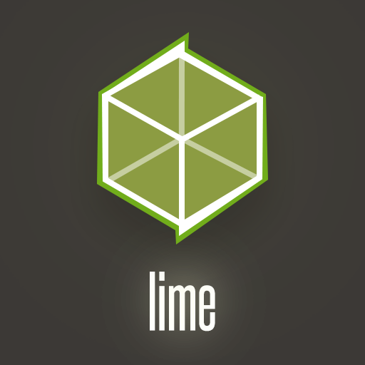

#lime 
---
light media engine   
A lightweight OpenGL framework for [haxe](http://haxe.org).

A starting point for building OpenGL applications across Mac, Windows, Linux, Blackberry, HTML5(WebGL), Android, iOS and more.

#What it does
	
lime exposes the following

- OpenGL
- Audio
- Input
- Windowing
- Useful native features

By setting up a bootstrap for your application, lime will handle all the low level events and call into your main class (this can be overridden) for you. 

#How it works

lime is a cross platform haxe library powered by [lime-tools](http://github.com/openfl/lime-tools), for building upon opengl across many platforms. 

### lime is two parts
**One part** is the native code, the underlying platform templates and systems to expose the features.    
**The second part** is the haxe wrapper, forwarding the events to your application.

For example, frameworks like [OpenFL](http://github.com/openfl) leverage lime to implement a cross platform Flash API by leaning on the native portion, without using the current lime haxe classes at all.

#Things to note

- lime (native, and wrapper) are low level. It does the bare minimum to give you access to the metal - without making it difficult.
- The lime wrapper works by default by bootstrapping your application main class into the framework. 
- The lime wrapper will call functions into your class, for mouse, keys, gamepad and other system or windowing events (resizing, for example). Then, you handle them.
- The lime wrapper exposes an API to talk to the windowing, audio and other API's across platforms.

- The lime GL wrapper code is based on WebGL Api. It matches very closely. Including types and constants.
- The lime native parts were forked from [nme](http://github.com/haxenme/nme) (native media engine) and merged into  openfl-native - but now (and lastly) been merged into lime and joined forces to create an agnostic, cross platform starting point to widen the haxe landscape for all frameworks and framework developers.

Expect docs, diagrams and breakdowns of how to get started using lime soon. See the examples/ folder for the basics for now.
